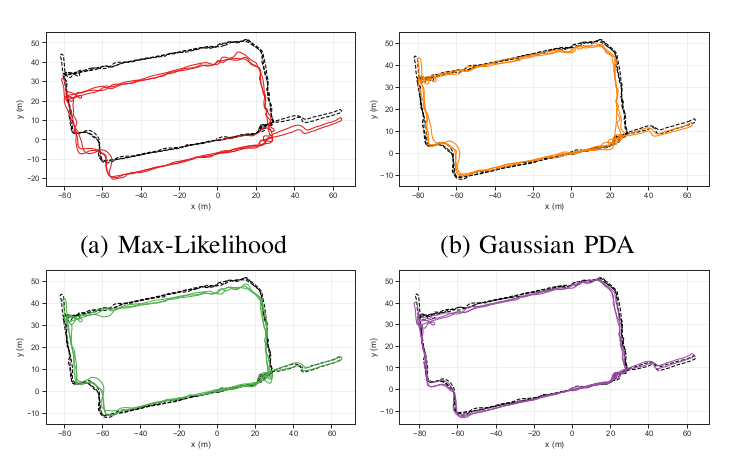
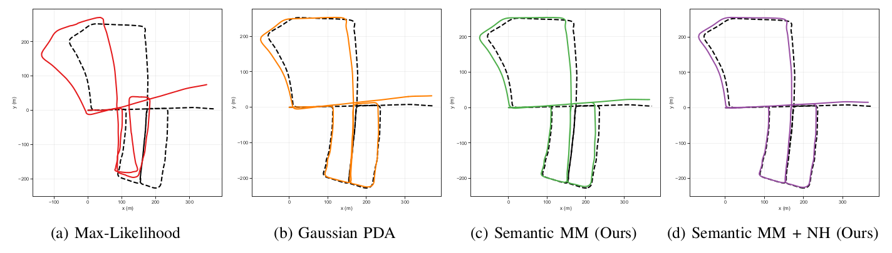
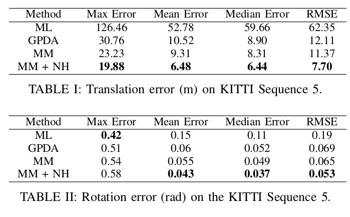

# Probabilistic Data Association via Mixture Models for Robust Semantic SLAM

## 摘要
类似于目标检测的视觉模型常被用于机器人系统对环境的感知中。我们希望在机器人导航中利用这些存在噪声信息。在此工作中，我们不依赖于目标检测的准确性，而是连同其中的语义和位置信息不确定性一起考虑。具体来说，我们将非高斯分布的数据关联不确定性融入到SLAM优化框架中。我们通过最大边缘化(max-marginalization)的方法将数据关联变量从推断过程中消去，同时保留标准高斯后验假设。其结果是一个能解释多种数据关联假设和错误回环检测的最大混合模(max-mixture)型。我们在室内和室外的里程计与目标检测均存在噪声的语义导航任务中进行了实验，说明相较于其他语义SLAM方法，我们的方法具备更强的鲁棒性。
## 引入

在语义SLAM中，我们需要将新观测到的问题与之前的观测建立的landmark进行关联。举个例子，之前的观测让我们知道了地图上有两辆车，新的观测是一辆车，我们要确定新观测到的车是之前的哪一辆。论文Probabilistic
data association for semantic SLAM[2]给这一问题的解决提出了一个数学框架，但存在计算量过大的问题。本文在此基础上提出了一种称为MAX
-MIXTURE近似方法解决该问题。

## 算法核心
**符号**

$\mathbf{X}=\{\boldsymbol{x}_{t} \in
\mathcal{X}\}_{t=1}^{T}$表示相机在不同时间的位姿。$L=\left\{\ell_{j} \in
\mathcal{L}\right\}_{j=1}^M$表示Landmark。$\left\{z_{t} \in
\mathcal{Z}\right\}_{t=1}^{T}$表示不同时间的观测。

于是SLAM问题可定义为一个求最大后验概率（MAP）问题：

 $\hat{\mathbf{X}},
\hat{\mathbf{L}}=\underset{\mathbf{X},
\mathbf{L}}{\operatorname{argmax}} p(\mathbf{X}, \mathbf{L} |
\mathbf{Z})$ (1)

其中 $\mathcal{L} \triangleq \mathrm{SE}(3) \times
\mathcal{C}$
包含了landmark的位置，姿态以及种类C。

在数据关联未知的情况下，我们用符号
$\mathbf{D}={\boldsymbol{d}_{t}}_{t=1}^{T}$
表示数据关联$d_{t k}=j$
表示时间t的第k个观测结果是对与landmark j的观测。从probabilistic data
association[2]中我们得知，我们可以通过求解边缘概率消去D：

$\begin{aligned} p(\mathbf{X}, \mathbf{L} | \mathbf{Z})
&=\mathbb{E}_{\mathbf{D}}[p(\mathbf{X}, \mathbf{L} | \mathbf{D},
\mathbf{Z}) | \mathbf{Z}]  &=\sum_{\mathbf{D}} p(\mathbf{X},
\mathbf{L} | \mathbf{D}, \mathbf{Z}) p(\mathbf{D} | \mathbf{Z})
\end{aligned}$ (2)

为了减少计算量，本文提出将sum-marginal代替max-marginal代替，于是（2）近似为：

$\hat{p}(\mathbf{X}, \mathbf{L} | \mathbf{Z}) \triangleq \max
_{\mathbf{D}} p(\mathbf{X}, \mathbf{L} | \mathbf{D}, \mathbf{Z})
p(\mathbf{D} |
\mathbf{Z})$（3）

*** MAX -MIXTURE SEMANTIC SLAM***

我们通过因子图（factor graph）可以重新表示问题为：$p(\mathbf{X}, \mathbf{L} | \mathbf{Z})
\propto \prod_{i} f_{i}\left(\mathbf{V}_{i}\right), \mathbf{V}_{i}
\subseteq{\mathbf{X},
\mathbf{L}}$
（4）

其中$f_i$是观测模型。

文章提出proactive max-marginalization用来计算数据关联权重，同时采用了null-hypothesis data
association[3]的方法拒绝错误的回环检测。

 **Proactive Max-Marginalization**

在式（3）中对所有时刻的观测Z计算max marginalization计算量较大，于是文章提出不考虑新的观测对过去数据关联结果的影响。

考虑新的观测
$\mathbf{Z}^{+}$
，旧的观测$\mathbf{Z}^{-}$，我们可以得$\begin{aligned}
p\left(\mathbf{X}, \mathbf{L}, \mathbf{D}^{+} | \mathbf{Z}^{+},
\mathbf{Z}^{-}\right) \propto & \ p\left(\mathbf{Z}^{+} | \mathbf{X},
\mathbf{L}, \mathbf{D}^{+}\right) p\left(\mathbf{X}, \mathbf{L} |
\mathbf{Z}^{-}\right) p\left(\mathbf{D}^{+} | \mathbf{Z}^{-}\right)
\end{aligned}$（5）

对 $D^{+}$ 使用max-marginal可得：

$\begin{array}{l} \hat{p}\left(\mathbf{X}, \mathbf{L} |
\mathbf{Z}^{+}, \mathbf{Z}^{-}\right)=  p\left(\mathbf{X}, \mathbf{L}
| \mathbf{Z}^{-}\right) \max
_{\mathbf{D}^{+}}\left[p\left(\mathbf{Z}^{+} | \mathbf{X}, \mathbf{L},
\mathbf{D}^{+}\right) p\left(\mathbf{D}^{+} |
\mathbf{Z}^{-}\right)\right]
\end{array}$（6）

其中 $p\left(\mathbf{X}, \mathbf{L} |
\mathbf{Z}^{-}\right)$可用max-marginal后的结果 $\hat{p}\left(\mathbf{X}, \mathbf{L} |
\mathbf{Z}^{-}\right)$代替。

 **计算数据关联权重**

文章假设数据关联概率 $p\left(d_{t k} |
\mathbf{Z}^{-}\right)$与似然 $p\left(\boldsymbol{z}_{t k} | d_{t k},
\mathbf{Z}^{-}\right)$成比例，而似然可分为semantic和geometric两部分：

$\begin{array}{rl} p\left(z_{t k}^{s} | d_{t k}=j,
\mathbf{Z}^{-}\right) & =  \sum_{c} & p\left(z_{t k}^{s} |
\ell_{j}^{s}=c\right) p\left(\ell_{j}^{s}=c | \mathbf{Z}^{-}\right)
\end{array}$（7）

两部分可分别计算：

$p\left(z_{t k}^{s} | d_{t k}=j, \mathbf{Z}^{-}\right)=\sum
p\left(z_{t k}^{s} | \ell_{j}^{s}=c\right) p\left(\ell_{j}^{s}=c |
\mathbf{Z}^{-}\right)$（8）

$\begin{array}{c} p\left(\boldsymbol{z}_{t k}^{p} | d_{t k}=j,
\mathbf{Z}^{-}\right)=  \iint p\left(z_{t k}^{p} | d_{t k}=j,
\boldsymbol{x}_{t}, \ell_{j}\right) p\left(\boldsymbol{x}_{t},
\ell_{j} | \mathbf{Z}^{-}\right) d \boldsymbol{x}_{t} d
\boldsymbol{\ell}_{j}
\end{array}$（9）

（9）可近似化简：

$p\left(\boldsymbol{z}_{t k}^{p} | d_{t k}=j, \mathbf{Z}^{-}\right)
\approx\iint p\left(z_{t k}^{p} | d_{t k}=j, \boldsymbol{x}_{t},
\ell_{j}\right) \hat{p}\left(\hat{\boldsymbol{x}}_{t},
\hat{\ell}_{j} | \mathbf{Z}^{-}\right) d \boldsymbol{x}_{t} d
\ell_{j}$（10）

$p\left(z_{t k}^{p} | d_{t k}=j, \mathbf{Z}^{-}\right)
\approx\frac{1}{\sqrt{\left|2 \pi R_{t j k}\right|}}
e^{-\frac{1}{2}\left\|h(\hat{\mathbf{x}})-z_{t k}^{p}\right\|_{R_{t j
k}}^{2}}$（11）

其中： $\left.\left.R_{t j k} \triangleq \frac{\partial h}{\partial
\mathbf{x}}\right|_{\hat{\mathbf{x}}} \Sigma \frac{\partial
h}{\partial \mathbf{x}}\right|_{\hat{\mathbf{x}}}
^{T}+\Gamma$（12）

 **Semantic Max-Mixture Factor**

有了上面的基础，我们可以来计算因子图中的 $f\left(\boldsymbol{x}_{t},
\ell_{\mathcal{H}}\right)$：

$f\left(\boldsymbol{x}_{t}, \ell_{\mathcal{H}}\right)=\max _{j \in
\mathcal{H}} p\left(\boldsymbol{z}_{t k} | \boldsymbol{x}_{t},
\ell_{j}\right) p\left(d_{t k}=j |
\mathbf{Z}^{-}\right)$（13）

其中 $\mathcal{H} \subseteq{1, \ldots,
M}$是观测可能的种类，我们也可用null-hypothesis的方法[3]将它扩充成 $\mathcal{H}
\cup{\emptyset}$。 $p\left(z_{t k} | \boldsymbol{x}_{t},
\ell_{j}\right)$我们可以通过重投影计算，而 $p\left(d_{t k}=j |
\mathbf{Z}^{-}\right)$由上文假设可以通过式（7）计算。

接着，我们可以计算landmark的后验种类：

$\hat{\ell}_{j}^{s}=\underset{c}{\operatorname{argmax}} \prod_{t}
\sum_{d_{t}} p\left(\boldsymbol{d}_{t}, \boldsymbol{\ell}_{j}^{s}=c |
\mathbf{Z}\right)$（14）

## 主要结果

图一：在MIT RACECAR数据集上的估计轨迹，黑色为参考轨迹。

图二：在KITTI Sequence 5上的估计轨迹。错误的闭环导致最大似然数据关联方法严重失效，但所有基于概率数据关联的方法有较好的鲁棒性。

表一：在KITTI Sequence 5上的平移及旋转误差。

## 相关论文

[1]Probabilistic Data Association via Mixture Models forRobust Semantic SLAM https://arxiv.org/pdf/1909.11213.pdf

[2]Probabilistic data association for semantic SLAM https://www.researchgate.net/publication/318697576_

[3]Probabilistic_data_association_for_semantic_SLAM^abSLAM with Objects using a Nonparametric Pose Graph https://arxiv.org/pdf/1704.05959.pdf